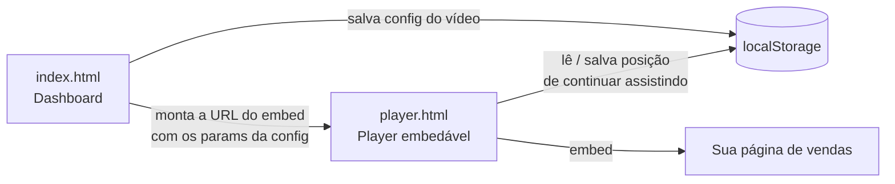

<div align="center">


# V Infinitum

**Um player de VSL completo. Construído uma vez. Seu para sempre.**

Dashboard de gerenciamento + player embedável — dashboard, autoplay inteligente, progresso que parece mais curto, CTA cronometrado, continuar assistindo, pixels — sem framework, sem backend, sem mensalidade.

[](https://claude.ai/download)
[](#arquitetura)
[](#arquitetura)
[](#deploy)

[Sobre](#sobre) · [Funcionalidades](#funcionalidades) · [Arquitetura](#arquitetura) · [Rodando localmente](#rodando-localmente) · [Deploy](#deploy) · [Identidade visual](#identidade-visual) · [Guia completo](#guia-completo)

</div>

---

## Sobre

Ferramentas de player de VSL como o VTurb cobram **R$97–297 por mês** por uma engenharia
relativamente simples: autoplay inteligente, uma barra de progresso calibrada pra parecer mais
curta, um botão de ação que aparece na hora certa, e um jeito de o espectador continuar de onde
parou. **V Infinitum** é a mesma engenharia — construída uma vez com o Claude Code, hospedada de
graça, e sua para sempre.

Dois arquivos HTML fazem o trabalho todo. Sem React, sem Next.js, sem bundler, sem servidor.
Tudo o que o dashboard salva vive no `localStorage` do navegador; tudo o que o player precisa
chega por parâmetros na própria URL do embed.

Este projeto carrega a identidade visual da **Infinitum** — fundo `#0A0A0A`, dourado `#D4AF37`,
acentos em roxo imperial e carmesim — no lugar do azul genérico do original. Veja a
[identidade visual](#identidade-visual) abaixo.

## Funcionalidades

- **Dashboard completo** — upload, biblioteca, configurações e embed numa interface só
- **Smart Autoplay** — o vídeo começa sozinho, mudo; um toque ativa o som
- **Progresso Inteligente** — a barra é calibrada pra parecer mais curta do que o vídeo realmente é
- **Botão de Ação (CTA)** — aparece no segundo exato configurado, com link de checkout
- **Continuar Assistindo** — quem saiu no meio volta de onde parou, não do zero
- **Pixels** — disparo de evento customizado por percentual assistido, sem dependência externa
- **Embed responsivo** — um código, funciona em qualquer página e qualquer tela
- **Sem controles nativos** — barra própria, sem botão de download, sem velocidade exposta

## Arquitetura



`index.html` e `player.html` não se importam um com o outro em tempo de execução — a única ponte
entre os dois é a **URL do player**, montada pelo dashboard a partir da configuração salva de
cada vídeo. Isso mantém o player embedável 100% independente: ele funciona sozinho, em qualquer
página, sem precisar do dashboard por perto.

Dois arquivos pequenos são compartilhados pelas duas páginas pra evitar duplicar lógica:

| Arquivo | Responsabilidade |
|---|---|
| `theme.css` | Tokens de marca (cores, fonte) usados nas duas páginas |
| `storage.js` | Schema do vídeo + CRUD sobre `localStorage`, e leitura/escrita da posição de "continuar assistindo" |

O contrato completo — schema do `localStorage` e a tabela de query params que o `player.html`
aceita — está documentado em [`docs/superpowers/specs/2026-09-03-vsl-player-design.md`](docs/superpowers/specs/2026-09-03-vsl-player-design.md).

## Rodando localmente

Requer apenas [Node.js](https://nodejs.org) (pra rodar o `npx http-server`) — nenhuma instalação
permanente é necessária.

```bash
npx http-server -p 3000
```

Abra `http://localhost:3000/index.html` pro dashboard, ou `http://localhost:3000/guia.html` pro
guia de construção.

## Deploy

Hospedagem estática gratuita na [Vercel](https://vercel.com):

```bash
npx vercel --prod
```

Siga o login (GitHub ou e-mail) — no ar em menos de um minuto. Os vídeos em si (arquivos MP4)
não ficam neste repositório; hospede-os num CDN (Bunny CDN, Cloudflare R2, etc.) e aponte a URL
no dashboard.

## Estrutura do projeto

```
v-infinitum/
├── index.html              # Dashboard de gerenciamento
├── player.html              # Player embedável
├── guia.html                 # Guia de construção (landing page)
├── theme.css                  # Tokens de marca compartilhados
├── storage.js                  # Schema + CRUD sobre localStorage
├── assets/
│   └── logo.svg                 # Ícone Ouroboros (logo + favicon)
├── .claude/
│   └── launch.json               # Config do servidor de preview local
└── docs/
    └── superpowers/
        ├── specs/                  # Spec de design da funcionalidade
        └── plans/                   # Plano de implementação, task a task
```

## Identidade visual

Paleta oficial Infinitum — ciclo alquímico Nigredo → Albedo → Citrinitas → Rubedo:

| | Token | Hex | Uso |
|---|---|---|---|
|  | `--bg` | `#0A0A0A` | Fundo principal (Nigredo) |
|  | `--gold` | `#D4AF37` | Ação / destaque |
|  | `--gold-warm` | `#C38B2F` | Hover sobre dourado |
|  | `--purple` | `#5C2A7E` | Acento secundário (Rubedo) |
|  | `--crimson` | `#9B1C2C` | Acento secundário (Rubedo) |
|  | `--cream` | `#F8F6F0` | Texto principal (Albedo) |
|  | `--silver` | `#E5E0D8` | Texto secundário (Albedo) |

Tipografia: **Inter**, com tracking largo no wordmark em caixa alta. Os tokens completos vivem em
[`theme.css`](theme.css).

## Guia completo

[`guia.html`](guia.html) é a landing page com o passo a passo completo — incluindo o prompt
exato pra construir sua própria versão com o Claude Code, com sua identidade visual ou a da
Infinitum. Abra localmente em `http://localhost:3000/guia.html`, ou publique junto no deploy.

---

<div align="center">

**Infinitum**
<br>
<sub>Do Nigredo ao Rubedo — transformação infinita.</sub>

</div>
